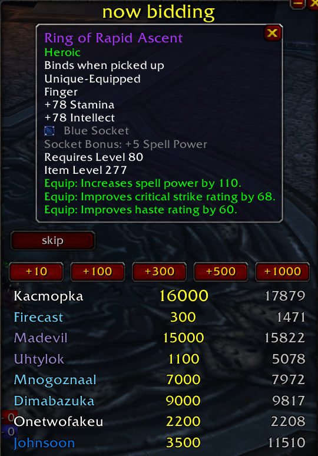

# Bid Item Popup

Кастомный аддон для отображения текущего лота аукциона, выставленного через QDKP. Теперь вы не пропустите биды :)

## Как это работает

- При открытии аукциона на вещь появляется всплывающее окно с информацией по предмету.
- В окне можно делать ставки и отслеживать ставки и количество ДКП других игроков.
- Если вы делаете ставку и вас перебивают, окно привлекает ваше внимание вспышкой и звуком (меняется в настройках).
- По умолчанию показываются только аукционы на подходящие вам по классу вещи, то есть маг не увидит плейт и т.п. Можно включить отображение всех аукционов в настройках.

## Установка

Скопируйте папку `BidItemPopup` в `Interface\AddOns` и включите аддон на экране выбора персонажа.

Настройки: `/biditem options`.

История изменений: [CHANGELOG.md](CHANGELOG.md).
